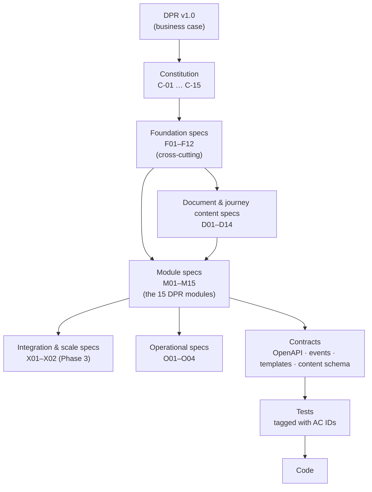
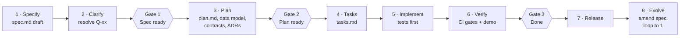
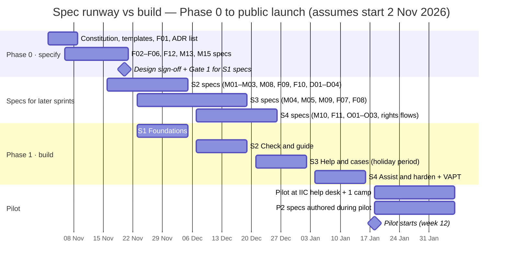

# 1dentity Web App — Spec-Driven Development Plan

| | |
|---|---|
| **Version** | 0.2 (draft for review) |
| **Date** | 4 October 2026 |
| **Source** | [`Identity_WebApp_DPR_v1.0.pdf`](../Identity_WebApp_DPR_v1.0.pdf) — Detailed Project Report v1.0 · 1dentity Developer PRD v1.0 (confidential; not in the repository) — see [`prd-reconciliation.md`](./prd-reconciliation.md) |
| **Covers** | Phase 0 (Discovery & design) through Phase 3 (Scale), months 1–12 |
| **Companion files** | [`specs/constitution.md`](../specs/constitution.md) · [`specs/README.md`](../specs/README.md) (spec register) · [`specs/backlog.md`](../specs/backlog.md) (seeded specs) · [`specs/open-questions.md`](../specs/open-questions.md) · [`specs/_templates/`](../specs/_templates/) |

---

## 1. Purpose

The DPR describes **what** Identity will build: 15 modules across a citizen app, a staff and volunteer console, and an admin console, shipped in three phases. This plan describes **how the team turns that into working software using spec-driven development (SDD)**: every behaviour is written down as a reviewable, testable specification before it is built, and the specification stays the source of truth after release.

This document defines:

1. The spec architecture: which specs exist and how they relate (§3).
2. The artifacts every spec produces and where they live in the repository (§4).
3. The workflow and quality gates from idea to release (§5).
4. The full spec inventory, mapped to the DPR's phases (§6).
5. The week-by-week plan: when each spec is written, approved and built (§7).
6. How specs become tests, and how CI enforces them (§8–§9).
7. Who does what, the meeting cadence, the risks, and the open decisions (§10–§14).

---

## 2. Why spec-driven development fits this system

| DPR characteristic | Consequence | SDD response |
|---|---|---|
| Rules, forms and fees change often (risk register: likelihood **High**) | Behaviour must change without code churn | Hard boundary between **spec'd logic** (rule *types*, engines, workflows) and **managed content** (rule *values*, fees, links, translations). See §4.3. |
| Some of the most sensitive data a citizen has (§09) | Privacy mistakes are expensive and hard to undo | A **constitution** of non-negotiables, a mandatory *Data & privacy* section in every spec, and a privacy-officer sign-off at the spec gate. |
| Four languages, RTL Urdu, WCAG 2.2 AA, budget phones (§07) | Easy to "finish" a feature that only works in English on a fast phone | Language, accessibility and performance are **acceptance criteria**, not polish tasks. |
| Small team, contractors, volunteers; handover expected (§11) | Knowledge must outlive the people who wrote the code | Specs and ADRs are the handover documentation; they are kept as-built. |
| Stage-gated funding; go/no-go after every phase (§10) | Leadership needs evidence that a phase is done | Phase gates check spec status and the traceability matrix, not opinions. |
| Rules-heavy logic (Health Check, Mismatch Detector, reminders) | Wrong answers erode trust | **Executable examples**: example tables in the spec become test fixtures, verbatim. |

### Working principles

1. **Spec first.** No production code without an approved spec (or an approved amendment). Spikes are allowed but are thrown away or turned into specs.
2. **Specs are living.** A change in behaviour is a change to the spec, in the same pull request.
3. **What before how.** `spec.md` is written in business language for the product owner, designers, volunteers and the privacy officer. Technical design goes in `plan.md`.
4. **Every requirement is testable and traced.** Requirements and acceptance criteria carry IDs; tests carry the same IDs; CI reports gaps.
5. **Right-size the spec.** Use a *full* spec for anything touching personal data, the rules engine or an external service; a *lite* spec (stories, acceptance criteria, out of scope) for everything else.
6. **Clarify, don't guess.** Ambiguity is marked `[NEEDS CLARIFICATION: Q-xx]` with a proposed default, tracked in [`open-questions.md`](../specs/open-questions.md) and timeboxed.

---

## 3. Spec architecture



| Layer | IDs | What it fixes | Changes when… |
|---|---|---|---|
| **Constitution** | `C-01`…`C-15` | Non-negotiable principles (privacy, trust, language, accessibility, stack) | Rarely — needs product owner **and** privacy officer approval |
| **Foundation** | `F01`…`F12` | Shared models and cross-cutting behaviour: domain model, content model, design system, i18n, auth, privacy lifecycle, documents, notifications, PWA, trust cues, measurement, platform | A cross-cutting capability changes |
| **Modules** | `M01`…`M15` | The 15 modules named in DPR §05, one spec each | A feature changes |
| **Content** | `D01`…`D14` | Per-document rules, checks, correction paths, filing scripts, cross-document journeys | A rule *type* or a document's structure changes (values change in the CMS, not here) |
| **Integration & scale** | `X01`, `X02` | DigiLocker / API Setu; partner centres | Phase 3 |
| **Operational** | `O01`…`O04` | Pilot, incident response, content verification, DPDP readiness | Process changes |

Module numbering follows the DPR's order:

| Citizen app | Staff & volunteer console | Admin & insights |
|---|---|---|
| M01 Health Check · **P1** | M09 Case Queue & SLA · **P1** | M13 Content Manager · **P1** |
| M02 Mismatch Detector · **P1** | M10 Filing Assistant · **P1** | M14 Impact Dashboard · P2 |
| M03 Smart Guides · **P1** | M11 Camp Manager · P2 | M15 Access & Audit · **P1** |
| M04 Request Help · **P1** | M12 Volunteer Hub · P2 | |
| M05 Book Appointment · **P1** | | |
| M06 Reminders · P2 | | |
| M07 Family Profile · P2 | | |
| M08 Hub & Scam Alerts · **P1** | | |

**MVP = 10 P1 modules** (M01–M05, M08, M09, M10, M13, M15), as in the DPR.

---

## 4. Artifacts and repository layout

### 4.1 Per-spec artifacts

Each spec lives in its own folder, `specs/<ID>-<slug>/`, created from [`specs/_templates/`](../specs/_templates/).

| File | Answers | Written by | Approved by | Required for |
|---|---|---|---|---|
| `spec.md` | *What* and *why*: stories, acceptance criteria, requirements, examples, data & privacy, language & accessibility, out of scope | Product owner + designer (with developers) | Product owner; privacy officer if any personal data; field coordinator for staff-facing specs | All specs |
| `research.md` | Options considered, evidence (e.g. help-desk query analysis, name-matching approaches) | Whoever investigated | — | When there's a real choice |
| `plan.md` | *How*: architecture, constitution check, data model, contracts, security design, test strategy, rollout | Developers | Tech lead (senior developer) + QA/security | Full specs |
| `data-model.md` | Entities, fields, retention class per field, Prisma delta | Developers | Privacy officer reviews retention | Specs touching the database |
| `contracts/` | OpenAPI fragments, event schemas, WhatsApp/SMS templates, content JSON Schemas | Developers | Tech lead | Specs with APIs, events or messages |
| `tasks.md` | Ordered tasks, tests first, each tied to FR/AC IDs | Developers | — | Before build |
| `CHANGELOG` section in `spec.md` | Amendments after approval | Spec owner | Same as spec | Always |

### 4.2 Repository layout (target)

```
/
├── Identity_WebApp_DPR_v1.0.pdf     # source business case (kept as-is)
├── docs/
│   ├── sdd-plan.md                  # this document
│   └── adr/                         # architecture decision records (ADR-001 …)
├── specs/
│   ├── constitution.md
│   ├── README.md                    # spec register: ID, phase, status, owner
│   ├── backlog.md                   # seeded requirements for every spec
│   ├── open-questions.md            # decisions and clarifications register
│   ├── _templates/                  # spec.md, plan.md, tasks.md
│   ├── F01-domain-model/
│   ├── M01-health-check/
│   └── D01-aadhaar/ …
├── apps/web/                        # one Next.js codebase, three surfaces (citizen / console / admin)
├── packages/
│   ├── rules/                       # pure TypeScript rules engine (Health Check, Mismatch) — runs in the browser
│   ├── content-schema/              # zod / JSON Schema for guides, rules, fees, forms, scripts
│   └── ui/                          # Urbanist UI tokens and components
├── prisma/                          # schema and migrations
└── tests/
    ├── acceptance/                  # Playwright, tagged @<ID>-AC-x.y
    ├── contract/
    └── fixtures/                    # executable examples exported from specs
```

The single-codebase, three-surface structure follows DPR §08 ("one codebase for citizens and staff"); it is recorded formally as ADR-001 in Phase 0.

### 4.3 The spec / content boundary

The DPR's highest-likelihood risk is that rules, forms and fees change. To keep those changes out of the code-release cycle:

| Lives in a **spec** (changed by pull request) | Lives in **managed content** (changed in M13 Content Manager) |
|---|---|
| The content *schema*: what a document, field, rule, fee, form, official link, checklist, filing script and journey look like | The values: "Form PAN CR-01", "₹75", the myAadhaar URL, a checklist's items |
| Rule *types* the engine understands (e.g. "field must match reference document", "update due N years after issue", "free until date") | Rule *instances* and their parameters (e.g. "free online document update until 14 June 2027") |
| Workflow: drafting, translation, review, publishing, "last verified" expiry | Each item's owner, source and last-verified date |
| Validation: official-link allowlist, required translations, effective dates | Translations |

If a content change needs a rule type the engine doesn't support, that is a spec amendment.

---

## 5. Workflow and quality gates



| Step | Input | Output | Owner | Exit criterion |
|---|---|---|---|---|
| 1 · Specify | DPR, [`backlog.md`](../specs/backlog.md) seed, help-desk evidence | `spec.md` (Draft) | Product owner + designer | All template sections filled or explicitly "N/A" |
| 2 · Clarify | `[NEEDS CLARIFICATION]` markers | Answers recorded in spec and in `open-questions.md` | Product owner | No *blocking* markers remain; non-blocking ones have an accepted default |
| **Gate 1 · Spec ready** | | Status → **Approved** | Product owner (+ privacy officer, + field coordinator for console specs) | See *Definition of Ready* below |
| 3 · Plan | Approved spec | `plan.md`, `data-model.md`, `contracts/`, ADRs | Developers | Constitution check passes, or exceptions are approved |
| **Gate 2 · Plan ready** | | Status → **Planned** | Tech lead + QA/security | Every acceptance criterion has a test level assigned |
| 4 · Tasks | Plan | `tasks.md` | Developers | Tasks small (≤ 1 day), ordered, tests first, each tied to FR/AC |
| 5 · Implement | Tasks | Code + tests in pull requests referencing spec IDs | Developers | CI green |
| 6 · Verify | Build | CI evidence, fortnightly demo against acceptance scenarios | QA + product owner | All CI gates pass; demo accepted |
| **Gate 3 · Done** | | Status → **Verified** | Product owner + QA | See *Definition of Done* below |
| 7 · Release | Verified specs | Release notes listing spec IDs and versions | Tech lead | Phase stage gate where applicable |
| 8 · Evolve | Pilot feedback, rule changes, incidents | Spec amendment (version bump + changelog) | Spec owner | Re-enters at step 1 or 3 |

### Definition of Ready (Gate 1)

- [ ] User stories are prioritised and each is independently testable.
- [ ] Every story has acceptance scenarios in *Given / When / Then* form, with IDs.
- [ ] Executable examples are present for any rule or calculation.
- [ ] *Data & privacy* table is complete (data item, purpose, consent, storage, who sees it, retention, deletion) and **signed off by the privacy officer**.
- [ ] Language, accessibility and **assisted-mode** behaviour are described.
- [ ] Content dependencies (D-specs, CMS entries, translations) are listed and scheduled.
- [ ] Out-of-scope is explicit.
- [ ] No blocking `[NEEDS CLARIFICATION]` remains.

### Definition of Done (Gate 3)

- [ ] Every acceptance criterion has at least one passing automated test tagged with its ID, or a documented manual test (only for things that can't be automated, such as a real WhatsApp delivery).
- [ ] All citizen-facing text exists in English, ಕನ್ನಡ, हिन्दी and اردو, reviewed by the language reviewer; Urdu verified in RTL.
- [ ] Automated accessibility checks pass; key flows checked with a screen reader and in large-text mode.
- [ ] Performance budget met on the reference budget-phone profile.
- [ ] Any access to personal data or documents writes an audit event; retention is configured and tested.
- [ ] Constitution checks pass in CI.
- [ ] `spec.md` and `plan.md` updated to match what was built (as-built).
- [ ] Demonstrated in the fortnightly demo.

### Change control

- Before approval, specs change freely.
- After approval, changes are **amendments**: bump the spec version, add a changelog line, and get the same approvers. Small clarifications that don't change behaviour need only the spec owner.
- A pull request that changes behaviour without touching the spec fails review.
- Constitution amendments use semantic versioning (see the constitution's *Governance* section).

### Tooling (optional)

The workflow is tool-agnostic and works with plain Markdown and pull requests. It maps one-to-one onto AI-assisted SDD toolkits such as GitHub Spec Kit (specify → clarify → plan → tasks → implement), so assistants like Claude Code can draft specs, plans and tasks from the templates. **Humans approve at every gate.**

---

## 6. Spec inventory

The full register, with owners and status, is in [`specs/README.md`](../specs/README.md). Seeded requirements, acceptance seeds and open questions for every spec are in [`specs/backlog.md`](../specs/backlog.md).

| ID | Spec | Phase | Size | Build window |
|---|---|---|---|---|
| F01 | Domain model, glossary & case lifecycle | P1 | Full | S1 |
| F02 | Document rules & content model | P1 | Full | S1 |
| F03 | Urbanist UI design system & status system | P1 | Full | S1 → S2 |
| F04 | Internationalisation & RTL | P1 | Full | S1 |
| F05 | Authentication & sessions | P1 | Full | S1 |
| F06 | Privacy, consent & data lifecycle | P1 | Full | S1 (policy) → S4 (rights flows) |
| F07 | Secure document handling | P1 | Full | S3 |
| F08 | Notifications (WhatsApp & SMS) | P1 | Full | S3 |
| F09 | PWA, performance & offline | P1 | Full | S2 |
| F10 | Trust & safety cues | P1 | Lite | S2 |
| F11 | Measurement & KPI events | P1 | Full | S4 |
| F12 | Platform, environments & delivery | P1 | Full | S1 |
| M01 | Health Check | P1 | Full | S2 |
| M02 | Mismatch Detector | P1 | Full | S2 |
| M03 | Smart Guides | P1 | Full | S2 |
| M04 | Request Help | P1 | Full | S3 |
| M05 | Book Appointment | P1 | Full | S3 |
| M06 | Reminders | P2 | Full | Month 4 |
| M07 | Family Profile | P2 | Full | Month 4 |
| M08 | Hub & Scam Alerts | P1 | Lite | S2 |
| M09 | Case Queue & SLA | P1 | Full | S3 |
| M10 | Filing Assistant | P1 | Full | S4 |
| M11 | Camp Manager | P2 | Full | Month 5 |
| M12 | Volunteer Hub | P2 | Full | Month 5 |
| M13 | Content Manager | P1 | Full | S1 |
| M14 | Impact Dashboard | P2 | Full | Month 6 |
| M15 | Access & Audit | P1 | Full | S1 (roles, audit) → S4 (deletion jobs) |
| D01–D03 | Aadhaar, PAN, Voter ID (EPIC) | P1 | Content | S1–S3 entry, S4 translation sign-off |
| D04 | Cross-document journeys (name change, address change, DOB, mobile linking) | P1 | Content | S2–S3 |
| D05–D09 | Ration card, birth & death, income/caste/residence, passport, driving licence | P2 | Content | Months 4–6 |
| D10–D14 | Scholarship readiness (NSP/SSP), e-Shram, PM-JAY, UDID, senior-citizen & pension | P3 | Content | Months 7–12 |
| X01 | DigiLocker / API Setu (subject to eligibility) | P3 | Spike → Full | Months 8–10 |
| X02 | Partner centres (masjids, colleges, NGOs) | P3 | Full | Months 7–9 |
| O01 | Pilot plan & measurement | P1 | Lite | Weeks 12–14 |
| O02 | Incident response & breach runbook | P1 | Lite | S4 |
| O03 | Content verification operations | P1 | Lite | S4, then monthly |
| O04 | DPDP readiness check | P2 | Lite | Month 7 |

---

## 7. Delivery plan — the spec runway

**Rule of thumb:** a spec is *approved at least one sprint before* the sprint that builds it. Developers plan and break down tasks in the first day or two of the build sprint.

Dates assume approval and a start on **Monday 2 November 2026** (DPR §10: "a start in November 2026"). Sprints are two weeks.



### 7.1 Phase 0 — Discovery & design (weeks 1–3, 2–20 Nov 2026)

Phase 0 is where SDD starts: discovery work produces the evidence that specs are built on.

| Week | Discovery (from DPR §10) | Spec work | Gate |
|---|---|---|---|
| 1 | Stakeholder workshops; start reviewing 6 months of anonymised help-desk queries | Ratify **constitution**; adopt templates; draft **F01** (domain model, case lifecycle, glossary); list ADRs (§7.6) | Constitution v1.0 ratified |
| 2 | Wireframes; Urbanist UI kit; content plan; inventory current guides, forms and fees | Draft **F02, F03, F04, F05, F06, F12, M13, M15**; start D01–D03 rule inventories from the fee/form inventory; decide ADR-001 to ADR-004 | — |
| 3 | Design sign-off (DPR milestone) | Clarify and **approve S1 specs**; draft S2 specs (M01, M02, M03, M08, F09, F10, D01–D04) using query analysis for executable examples | **Gate 1 for S1 specs** = design sign-off |

**Phase 0 exit:** constitution ratified; S1 specs approved; S2 specs in review; ADR-001 to ADR-004 decided; open-questions register triaged with owners and due dates.

### 7.2 Phase 1 — MVP build (weeks 4–11, 23 Nov 2026 – 15 Jan 2027)

| Sprint | Weeks / dates | Build (specs must be **Approved**) | Spec authoring in parallel (for next sprint) |
|---|---|---|---|
| **S1 · Foundations** | 4–5 · 23 Nov – 4 Dec | F12 platform & CI; F05 auth; M15 roles + audit log; F01 schema; F04 i18n framework; F03 tokens & core components; F02 content schema; M13 Content Manager core (draft, review, publish, versions, last-verified) | Approve S2 specs by 4 Dec; draft S3 specs |
| **S2 · Check & guide** | 6–7 · 7–18 Dec | `packages/rules` engine; M02 Mismatch Detector; M01 Health Check; M03 Smart Guides; M08 Hub & Scam Alerts; F09 offline guides; F10 trust cues; D01–D04 content entered in M13 | Approve S3 specs by 18 Dec; draft S4 specs |
| **S3 · Help & cases** | 8–9 · 21 Dec – 1 Jan | F07 secure uploads; M04 Request Help (case creation, consent, timeline); M05 Book Appointment (desk slots, doorstep requests, pilot-camp tokens with QR); M09 Case Queue & SLA; F08 WhatsApp/SMS case updates | Approve S4 specs by 1 Jan (aim for 24 Dec, before the holiday); draft O01 |
| **S4 · Assist & harden** | 10–11 · 4–15 Jan | M10 Filing Assistant; M15 deletion & anonymisation jobs; F06 rights flows (withdraw consent, erasure, grievance); F11 KPI events + closing survey; O02 incident runbook; O03 verification routine; **VAPT and fixes**; full accessibility pass; translation sign-off for all four languages | Approve O01; start P2 spec seeds |

**Holiday capacity:** S3 spans Christmas and New Year. Plan S3 at about 70% capacity and keep its scope to M04, M05, M09 and F07; F08 can move to S4 if WhatsApp template approval (an external dependency) is late — case updates then fall back to SMS.

**Phase 1 exit (stage gate before pilot):** all 10 P1 module specs and the P1 foundation specs are **Verified**; critical and high VAPT findings closed; D01–D04 published in four languages with "last verified" dates; O01 pilot plan approved.

### 7.3 Pilot (weeks 12–14, 18 Jan – 5 Feb 2027)

Specified in **O01**. About 200 citizens at the IIC help desk and one camp; measure time saved, errors and satisfaction (DPR §10).

SDD activities during the pilot:

- Every defect or confusion found is logged against a spec ID and acceptance criterion (or reveals a missing one).
- P1 specs are **amended** from findings before public launch (spec version bumps).
- Year-1 KPI targets are re-baselined (DPR §12: "to be confirmed after the pilot").
- **P2 specs are authored and approved** (M06, M07, M11, M12, M14, D05–D09) so Phase 2 starts on time.

**Exit (public launch, month 4 — Feb 2027):** amended P1 specs verified; launch readiness checklist in O01 met.

### 7.4 Phase 2 — Growth features (months 4–6, Feb – Apr 2027)

| Month | Build | Spec authoring |
|---|---|---|
| 4 (Feb) | M06 Reminders (expiries, 10-year Aadhaar refresh, child biometrics at 5 and 15); M07 Family Profile (up to 8 members, metadata only) | D05–D09 content; X02 draft |
| 5 (Mar) | M11 Camp Manager (events, registrations, on-site intake, token display); M12 Volunteer Hub (onboarding, training, certification, rosters) | O04 DPDP readiness; D10–D14 seeds |
| 6 (Apr) | M14 Impact Dashboard (aggregates only); D05–D09 published; usability testing with citizens and volunteers (DPR budget line B) | X01 research spike |

**Exit (month 7, May 2027 — "Phase-2 release & DPDP readiness check"):** P2 specs verified; **O04** DPDP readiness check passed (the DPR notes most data-fiduciary obligations apply from around May 2027); release VAPT done.

### 7.5 Phase 3 — Scale (months 7–12, May – Oct 2027)

| Months | Build | Notes |
|---|---|---|
| 7–9 | X02 partner centres (desks at masjids, colleges, NGOs — multi-centre scoping of queues, slots, roles and dashboards); D10–D14 content | F01 includes a `Centre` entity from day one, so this extends the model rather than reworking it |
| 8–10 | X01 DigiLocker / API Setu — research spike first; full spec only if Identity is eligible | Subject to eligibility (DPR §08) |
| 12 | Year-1 review; annual VAPT and privacy review | Constitution and all specs reviewed for currency |

### 7.6 ADRs to decide in Phase 0

| ADR | Decision | Needed by |
|---|---|---|
| ADR-001 | One Next.js + TypeScript codebase serving citizen, console and admin surfaces | Week 2 |
| ADR-002 | Rules engine as a pure TypeScript package that runs in the browser (Health Check privacy) and on the server (validation) | Week 2 |
| ADR-003 | Content Manager: build in-app vs adopt a Postgres-backed headless CMS | Week 2 |
| ADR-004 | India-region cloud provider; managed PostgreSQL; S3-compatible storage; backups | Week 2 |
| ADR-005 | Citizen login OTP channel (SMS via DLT, or WhatsApp authentication template) | Week 3 |
| ADR-006 | i18n library and translation file format | Week 3 |
| ADR-007 | Background jobs and scheduling (reminders, SLA timers, retention jobs) | Week 5 |
| ADR-008 | Privacy-friendly analytics and error tracking (no advertising trackers) | Week 5 |
| ADR-009 | WhatsApp Business Platform provider | Week 4 (onboarding lead time) |

### 7.7 Build sequence after the Developer PRD (October 2026)

The PRD re-prioritises scope into P0 / P1 / P2 (PRD §32). Increments follow it; each one is specified, built, verified and pushed before the next.

| Increment | PRD priority | Specs | Delivers | Status |
|---|---|---|---|---|
| 1 | — | F01–F04, F12, M01, M02 v0.2 | Anonymous Quick Check on the device | Done |
| 2 | P0 | M02 v1.0, M16 (engine), M18, F02 v0.3, F03 v0.3 | Normalisation, six-status comparison, target suggestions, issue report, rules knowledge base, dependency-ordered roadmap — pure, tested engines | Done |
| 3 | P0 | F01 v0.3, F05, M15, F07 | Database, encryption, audit log, encrypted file store, citizen sign-in, staff sign-in with MFA, roles | Done |
| 4 | P0 | M16 v0.2, M17, F06, ADR-015 | Full Check: sign-in, consent, profile, documents (typed or uploaded), OCR and verification, report, targets and overrides, roadmap, privacy notice, withdrawal and deletion | Done |
| 5 | P0 | M13 v0.2, M15 v0.3, F05 v0.4, F01 v0.5 | Staff console: sign-in with TOTP, dashboard, customer list without personal data, rules admin (versions, differences, second-person publishing, verification, service prices), audit log viewer, team management | Done |
| 6a | P1 | M04, M09 (+ M10 filing record), F06 v0.3, M15 v0.4, F01 v0.6 | Assistance cases: request from a roadmap step with consent, masked queue by priority and SLA, claim and assign, checklist, notes, filing reference, completion with proof, citizen tracker and replies, case-file retention | Done |
| 6b | P1 | F08, F06 v0.4, F01 v0.7 | Notifications: in-app list with unread count, opt-in SMS with the case ID and a link only, quiet hours, retries, 90-day retention | Done |
| 6c | P1 | M19 | Service fees and payments: fee on the case, desk payment records, gateway interface, revenue view | Next |
| 6d | P1 | M07 | Family profiles: people under one account with their own Full Check and cases | Next |
| 7 | P2 | M06, X01, X02, D-series | Mobile app, advanced address matching, more states and boards, multilingual OCR, authorised integrations, expiry reminders | Later |

Pilot rule (PRD §36): every correction recommendation is validated manually by staff during the pilot before scaling.

---

## 8. Verification strategy — from spec to test

| Spec section | Becomes | Level | Tool (suggested) |
|---|---|---|---|
| Executable examples (rule tables) | Table-driven tests; the fixture file is generated from the spec table | Unit | Vitest on `packages/rules` |
| Acceptance scenarios | End-to-end tests tagged `@<ID>-AC-x.y` | Acceptance | Playwright (mobile viewport, all four locales for smoke tests) |
| Contracts | Schema validation and contract tests | Contract | OpenAPI + zod |
| Data & privacy table | Privacy assertions: retention jobs, access rules, audit events, network-capture checks | Integration / E2E | Vitest + Playwright |
| Language & accessibility | Locale completeness, RTL snapshots, axe checks, large-text mode | E2E | Playwright + axe-core |
| Non-functional | Performance budget on a throttled budget-phone profile; offline guide checks | E2E | Lighthouse CI |
| Security | Dependency audit, static analysis, secret scanning; VAPT before pilot, at Phase-2 release and yearly | CI + external | — |

### 8.1 Executable examples from the DPR

The DPR already contains examples that become the first fixtures:

**Mismatch Detector worked example (DPR §06)** → `M02` fixture `mismatch-irfan`

| Field | Aadhaar | PAN | Voter ID | Expected |
|---|---|---|---|---|
| Name | Mohammed Irfan | Mohd. Irfan | Mohammed Irfan | **PAN** mismatch (abbreviation variant) |
| DOB | 12-06-1990 | 12-06-1990 | 01-01-1990 | **EPIC** mismatch |
| Gender | Male | — | Male | OK |
| Address | Shivajinagar | — | Shivajinagar | OK |
| Mobile linked to Aadhaar | No | — | — | **Fix** |

Expected action plan, in order: (1) link mobile to Aadhaar — nearest centre, ₹75, book a slot; (2) correct PAN name to match Aadhaar — Form PAN CR-01 via Protean or UTIITSL; (3) correct DOB on Voter ID — Form 8 on the Voters' Service Portal, free. Health score **58**, rising to **100** once all three are done.

**Home screen example (DPR §07)** → `M01` fixture `health-fatima`: Aadhaar valid; PAN surname differs (Fatima Ansari vs Fatima Shaikh) → mismatch; Voter ID new address pending → update due. Health score **72**, "Good — 2 issues", 3 documents checked.

Both examples are consistent with a flat deduction of 14 points per open issue (3 issues → 58; 2 issues → 72). Whether issues should be weighted by severity is open question **Q-01**; whatever is chosen must keep passing these two fixtures or the DPR examples must be updated.

### 8.2 CI quality gates

| Gate | Fails the build when… | Protects |
|---|---|---|
| Types, lint, unit tests | Any failure | — |
| Traceability | An **Approved/Verified** spec's acceptance criterion has no tagged test; a test references an unknown ID | SDD integrity |
| i18n completeness | A citizen-facing key is missing in `en`, `kn`, `hi` or `ur` | C-08 |
| RTL | Urdu snapshot of key screens is not mirrored | C-08 |
| Accessibility | axe reports a serious or critical violation on a key flow; contrast tokens fail AA | C-09 |
| Performance budget | Key pages exceed the agreed budget on the budget-phone profile | C-10 |
| Health Check stays on the device | During the Health Check flow, any request body or URL contains a value the user entered | C-04 |
| No full Aadhaar | Schema lint finds an Aadhaar field longer than 4 digits; a 12-digit Verhoeff-valid number is found in seed data, logs or fixtures | C-03 |
| No credential capture | A form schema contains an OTP, PIN or password field outside citizen login (F05) | C-02 |
| No trackers | Content Security Policy or bundle contains a script origin outside the allowlist | C-14 |
| Official links only | A guide link is not on the official-domain allowlist (F02) | C-01 |
| Content freshness | A published guide's "last verified" date is older than the agreed limit (warning first, then blocking) | C-13 |
| Retention | Retention-job tests fail | C-05 |

---

## 9. Traceability

**ID scheme**

| Item | Pattern | Example |
|---|---|---|
| Constitution principle | `C-NN` | `C-03` Masked Aadhaar only |
| Spec | `F/M/D/X/O` + 2 digits | `M02` |
| Functional requirement | `<spec>-FR-NN` | `M02-FR-04` |
| Acceptance criterion | `<spec>-AC-<story>.<n>` | `M02-AC-1.3` |
| Executable example | `<spec>-EX-<slug>` | `M02-EX-irfan` |
| Open question | `Q-NN`; DPR decision `DEC-N` | `Q-03`, `DEC-4` |
| Test | tagged with the AC or EX ID | `test('… @M02-AC-1.3', …)` |

A CI script builds `docs/traceability.md` on every merge: **DPR section → spec → FR → AC → test → status**. The phase stage gate reviews this matrix.

### 9.1 DPR coverage map

Every part of the DPR maps to at least one spec.

| DPR section | Covered by |
|---|---|
| §01 Checks · Compares · Guides · Assists · Tracks · Reminds | M01 · M02 · M03 · M05 · M04 + M09 · M06 |
| §02 Why now — free myAadhaar update to 14 Jun 2027; PAN CR-01/CR-02 from 1 Apr 2026; Karnataka roll revision; DPDP Rules | D01 · D02 · D03 · F06 + O04; effective-dated rules in F02 |
| §02 Six problems — mismatches; changing rules; digital barriers; scams; lost time; no visibility | M02 · M13 + F02 + O03 · F04 + F05 (assisted) + M05 · M08 + F10 · M03 + M05 · M04 + M09 + F11 + M14 |
| §03 Personas (Fatima, Ravi, Ayesha, Haji Yusuf, Suresh) and impact hotspots | D04 journeys; M05 evening slots and doorstep; F06 minors; M02 transliteration; M06 child biometrics |
| §04 Service scope by phase; four ways of delivering help | D01–D14; M03 (self-serve), M10 (assisted), M05 (doorstep), M05 + M11 (camps) |
| §05 15 modules in three apps | M01–M15 |
| §06 Journey and signature features (assisted mode, smart reminders, official links only) | M01–M04, M06; C-11; F10 + F02 allowlist |
| §07 Urbanist UI, status system, UX principles, screen concepts | F03, F04, F09; C-08 to C-12 |
| §08 Architecture and recommended stack | F12, F05, F07, F08; ADR-001 to ADR-009; C-15 |
| §09 Data protection, data lifecycle, disclaimers, volunteer code of conduct | C-01 to C-07; F06, F07, F10, M15, O02; M12 (P2) |
| §10 Roadmap, milestones, governance | §7 and §11 of this plan |
| §11 Team and budget | §10 of this plan |
| §12 KPIs, measurement and risk register | F11, M14, O01; §13 of this plan |
| §13 Decisions and first 30 days | `open-questions.md` DEC-1 to DEC-6; §14 of this plan |

---

## 10. Roles and responsibilities

Roles are those in DPR §11. R = responsible, A = accountable/approves, C = consulted, I = informed.

| Activity | Product owner | UI/UX designer | Developers | QA & security | Content & translation | Privacy & grievance officer | Field coordinators & volunteers | IIC leadership |
|---|---|---|---|---|---|---|---|---|
| Constitution | A | C | R | C | C | A | C | I |
| `spec.md` (module, foundation) | A/R | R | C | C | C | C | C | I |
| *Data & privacy* section | R | — | C | C | — | **A** | — | — |
| Staff-console specs (M09–M12) | A | R | C | C | — | C | **C (must review)** | — |
| D-series content specs | A | C | C | — | **R** | C | C | — |
| `plan.md`, contracts, ADRs | C | C | R | A (test strategy) | — | C (data model) | — | — |
| Tests and CI gates | I | — | R | A | — | C | — | — |
| Translations | C | C | — | C | R/A | — | C | — |
| Phase stage gate | R | C | C | C | C | C | C | **A** |

Because the product owner is planned at 30–40% time (DPR §11), approvals are batched into a fixed weekly **spec review slot** (§11) rather than handled ad hoc.

---

## 11. Cadence

Built on the DPR's governance rhythm.

| Rhythm | DPR meeting | SDD content |
|---|---|---|
| Weekly | Stand-up: product owner + build team | Spec status, blocking `Q-xx`, approvals due this week |
| Weekly | **Spec review slot** (new, 60 min) | Gate 1 / Gate 2 reviews; amendments; privacy officer joins for specs with personal data |
| Fortnightly | Live demo to the Identity team | Demo **against acceptance scenarios**; volunteers check console flows; feedback becomes amendments |
| Monthly | Progress, spend and risk note to IIC | Traceability summary: specs by status, acceptance criteria covered, open questions, content freshness |
| Monthly | "Last verified" content review (DPR §10) | O03 routine; one owner per document |
| Stage gate | Go / no-go review after each phase | All phase specs Verified; traceability matrix; VAPT status; KPI evidence |

---

## 12. Team-level risks to the SDD approach

| Risk | Mitigation |
|---|---|
| Spec writing slows an 8-week MVP | Lite specs where allowed; seeded backlog already drafted; one-sprint runway, not more; clarifications timeboxed to 3 working days, then the proposed default applies |
| Product owner bandwidth (30–40%) becomes a bottleneck | Fixed weekly review slot; designer and tech lead pre-review; batched approvals |
| Specs drift from code after launch | "Spec updated" is in the Definition of Done; CI traceability gate; PR template asks for the spec ID |
| Translation is the long pole for four languages | Content specs approved in Phase 0; strings frozen one sprint before release; reviewer per language (DPR §11); pseudo-locale testing from S1 |
| External lead times (WhatsApp provider, template approval, DLT registration, domain) | Start in the first 30 days (DPR §13); SMS fallback in F08; in-app status always available |
| Holiday period inside Phase 1 (S3) | Plan S3 at ~70% capacity; F08 can slip to S4 |
| Rules change mid-build (e.g. new forms or fees) | Content/spec boundary (§4.3); effective-dated rules; monthly verification |
| Legal interpretation of DPDP obligations changes specs late | Legal review before launch (DPR §09) scheduled in S4; F06 written so retention and consent values are configuration, not code |

The DPR's product risk register (§12) maps onto specs: rule changes → F02, M13, O03; data breach → C-03 to C-07, F06, F07, M15, O02; brand misuse → F10, M08; low digital literacy → C-11, F05, M05, F08; volunteer turnover → M10, M12, M15; portal downtime → F01 case lifecycle ("with the authority" stage), M03; funding gaps → C-15, M14.

---

## 13. Decisions and clarifications

Tracked in [`specs/open-questions.md`](../specs/open-questions.md), each with an owner, a "needed by" week, the specs it blocks, and a proposed default.

- **DEC-1 to DEC-6** are the six decisions the DPR asks IIC to make (§13). DEC-2 (appoint a product owner and a privacy & grievance officer) blocks every spec approval, because those two people are mandatory approvers.
- **Q-01 to Q-25** are spec-level clarifications found while preparing this plan. The ones with the widest impact:
  - **Q-01** Health score model (two DPR examples constrain it — see §8.1).
  - **Q-03** Which name variants count as a mismatch (e.g. "Mohd." vs "Mohammed").
  - **Q-04** Where Health Check results are kept, given "nothing is stored unless they open a case" but the home screen shows "Last check: today".
  - **Q-05** How people without their own phone (e.g. Haji Yusuf) or sharing a family phone open and follow cases.
  - **Q-06** Minors: the DPDP Act treats under-18s as children, which affects personas such as Ayesha (17) and child biometric reminders.
  - **Q-07** What happens when a citizen uploads an unmasked Aadhaar copy.

---

## 14. First 30 days — SDD checklist

Merged with the DPR's own "first 30 days after approval" list.

- [ ] DEC-1 and DEC-2 made: scope and budget approved; product owner and privacy & grievance officer appointed.
- [ ] Constitution ratified (week 1) by the product owner and privacy officer.
- [ ] Spec templates adopted; spec review slot booked weekly; PR template asks for spec IDs.
- [ ] Stakeholder workshop with the Identity team — output feeds F01 glossary and persona scenarios.
- [ ] Anonymised samples of common help-desk cases collected — output becomes executable examples for M01, M02 and D04.
- [ ] Inventory of current guides, forms and fees per document — output becomes D01–D03 rule inventories.
- [ ] At least two developer or agency quotes, each asked to work to this SDD process and to estimate against the spec register.
- [ ] Wireframes of the 5 key screens linked from M01, M02, M04, M09 and the home screen in F03.
- [ ] Domain registered (DEC-5); WhatsApp provider (ADR-009) and SMS DLT onboarding started.
- [ ] ADR-001 to ADR-004 decided.
- [ ] S1 specs approved at design sign-off (week 3); S2 specs in review.
- [ ] Repository scaffolded per §4.2 with CI gates from §8.2 in "report-only" mode, switching to "blocking" from S2.
